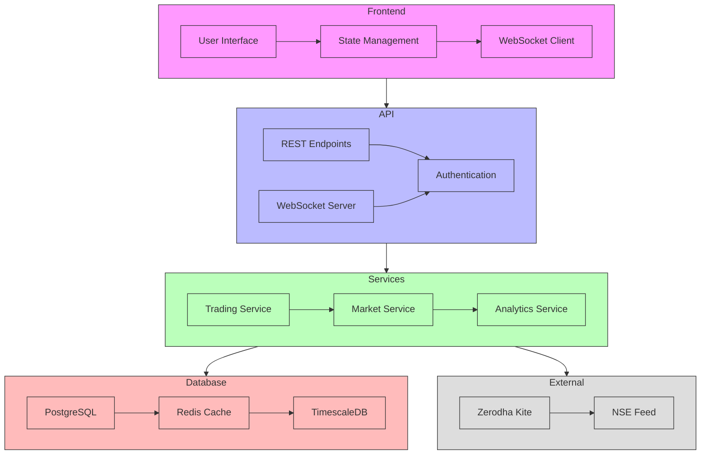
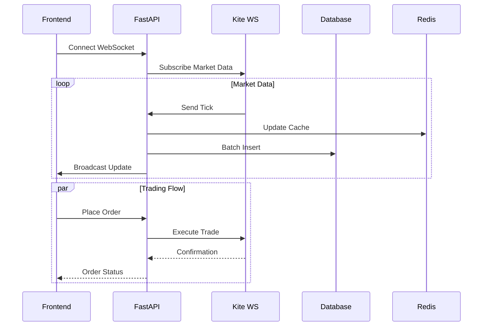
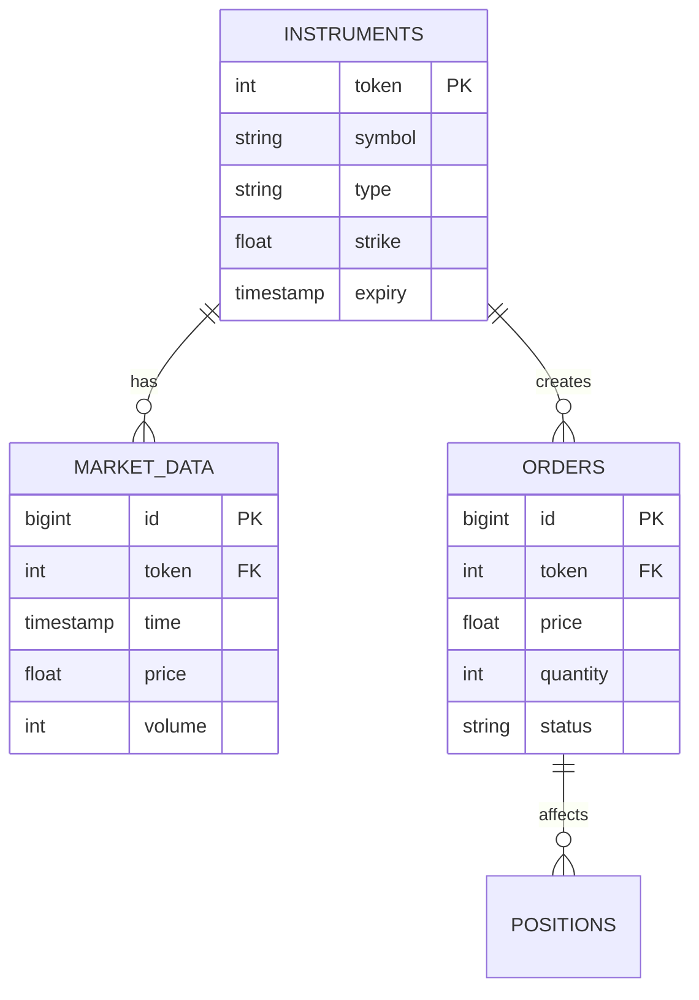
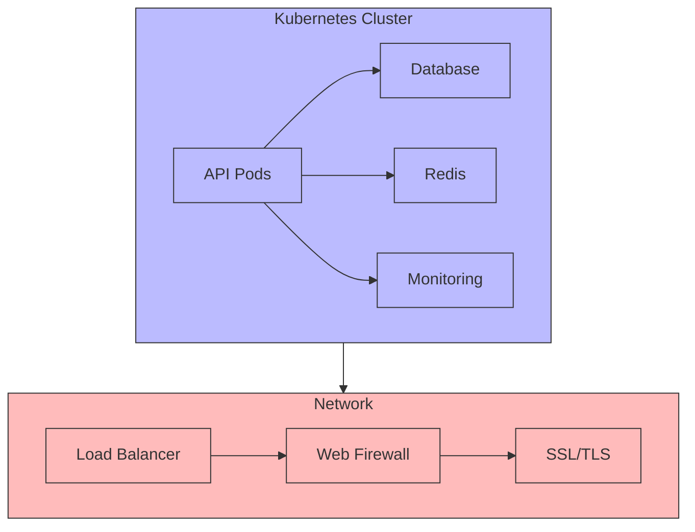

# NIFTY 50 Trading System Architecture

## 1. High-Level System Overview


## 2. Data Flow


## 3. Database Schema


## 4. Infrastructure


## 5. Data Processing
```mermaid
flowchart TB
    Input[Market Data Input] --> Process[Processing]
    Process --> Storage[Storage]
    Process --> Cache[Cache]
    
    subgraph Process
        Valid[Validation] --> Norm[Normalization]
        Norm --> Filter[Filtering]
        Filter --> Agg[Aggregation]
    end

    Cache --> Output[Data Output]
    Storage --> Output

    classDef input fill:#f96,stroke:#333
    classDef process fill:#bbf,stroke:#333
    classDef storage fill:#bfb,stroke:#333
    classDef output fill:#f9f,stroke:#333

    class Input input
    class Process,Valid,Norm,Filter,Agg process
    class Storage,Cache storage
    class Output output
