# Data Pipeline Architecture 🔄

## Overview

This document outlines the data flow and processing pipeline in our NIFTY 50 HFT system. The system is designed to handle high-frequency market data efficiently while ensuring data integrity and minimal latency.

## System Components and Data Flow

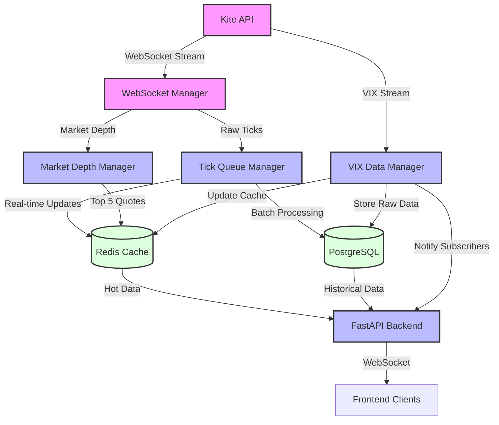

## Data Processing Stages

### 1. Data Ingestion
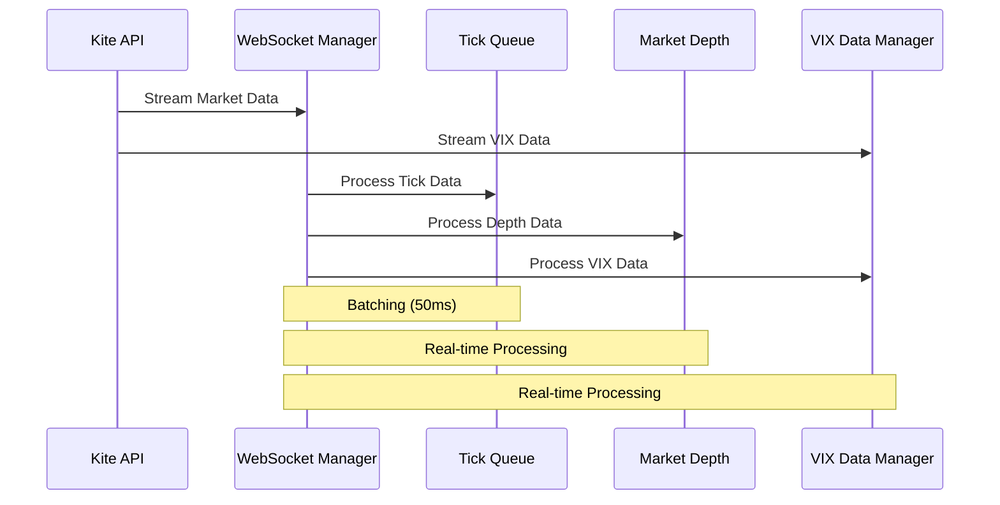

### 2. Data Storage Pipeline
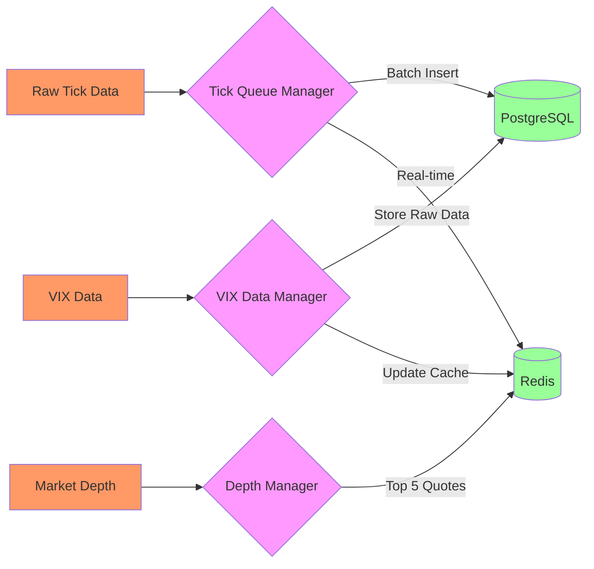

## Component Details

### 1. WebSocket Manager
- **Purpose**: Handles real-time data stream from Kite API
- **Features**:
  - Connection management and auto-reconnection
  - Data validation and parsing
  - Initial distribution to processing pipelines

### 2. Tick Queue Manager
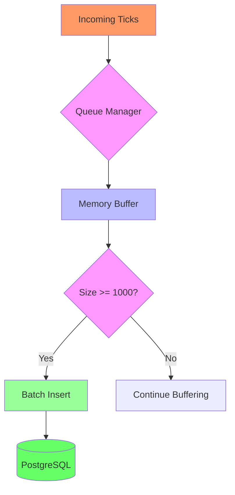

### 3. Market Depth Manager
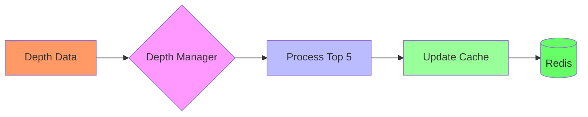

### 4. VIX Data Manager
```python
class VIXProcessor:
    def __init__(self):
        self.cache = RedisCache()
        self.db = PostgresDB()
    
    async def process_vix_tick(self, tick: Dict[str, Any]):
        """Single-responsibility VIX processor"""
        # Store raw data
        await self.db.store_vix_tick(tick)
        
        # Update cache with latest value
        await self.cache.set_vix_data({
            'value': tick['last_price'],
            'timestamp': tick['timestamp'],
            'change': tick['change']
        })
        
        # Notify subscribers if significant change
        if abs(tick['change']) > 0.5:  # 0.5% threshold
            await self.notify_subscribers(tick)
```

### 5. Market Depth Manager
```python
class MarketDepthManager:
    def __init__(self):
        self.batch_size = 100
        self.depth_queue = asyncio.Queue()
    
    async def process_depth(self, depth: Dict[str, Any]):
        """Single pipeline for market depth"""
        # Validate
        if not self.is_valid_depth(depth):
            return
            
        # Process
        processed_depth = self.format_depth(depth)
        
        # Store
        await self.depth_queue.put(processed_depth)
        if self.depth_queue.qsize() >= self.batch_size:
            await self.flush_queue()
    
    def format_depth(self, depth: Dict[str, Any]) -> Dict[str, Any]:
        """Single format function for consistency"""
        return {
            'instrument_token': depth['instrument_token'],
            'timestamp': depth['timestamp'],
            'bids': self.format_orders(depth['bids']),
            'asks': self.format_orders(depth['asks'])
        }
```

## Data Types and Structures

### Tick Data Structure
```typescript
interface TickData {
    instrument_token: number;
    timestamp: string;
    last_price: number;
    volume: number;
    open_interest: number;
    change: number;
}
```

### Market Depth Structure
```typescript
interface MarketDepth {
    instrument_token: number;
    timestamp: string;
    bids: Array<{
        price: number;
        quantity: number;
        orders: number;
    }>;
    asks: Array<{
        price: number;
        quantity: number;
        orders: number;
    }>;
}
```

### VIX Data Structure
```typescript
interface VIXData {
    timestamp: Date;
    value: number;
    change: number;
    high: number;
    low: number;
    open: number;
    close: number;
    trend: 'UP' | 'DOWN' | 'STABLE';
}
```

## Performance Metrics

### Latency Targets
- Tick Processing: < 1ms
- Market Depth Updates: < 2ms
- Database Batch Insert: < 50ms
- Frontend Update: < 100ms

### Throughput Capacity
- Maximum Ticks/Second: 10,000
- Maximum Market Depth Updates/Second: 1,000
- Database Inserts/Second: 20,000
- WebSocket Messages/Second/Client: 100

## Data Integrity Measures

### Gap Detection
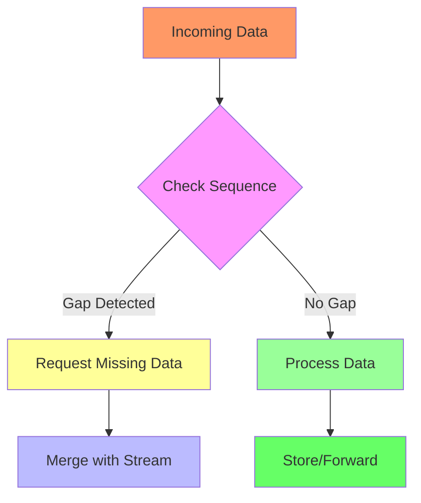

### Recovery Mechanism
1. Detect missing data through sequence numbers
2. Request specific missing data points
3. Merge recovered data with real-time stream
4. Maintain data consistency in storage

## Monitoring and Alerting

### Key Metrics Monitored
- WebSocket connection status
- Data processing latency
- Queue sizes
- Database write performance
- Cache hit rates
- Data gap occurrences

### Alert Thresholds
- Connection Loss: Immediate
- Processing Latency: > 100ms
- Queue Size: > 5000 items
- Data Gaps: > 5 seconds
- Database Latency: > 1 second

## Scaling Considerations

### Horizontal Scaling
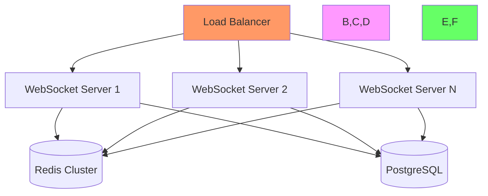

### Vertical Scaling Points
- WebSocket connection handling
- Tick data processing
- Market depth calculations
- Database write operations
- Cache management

## Data Integrity and Recovery System

### Missing Data Management

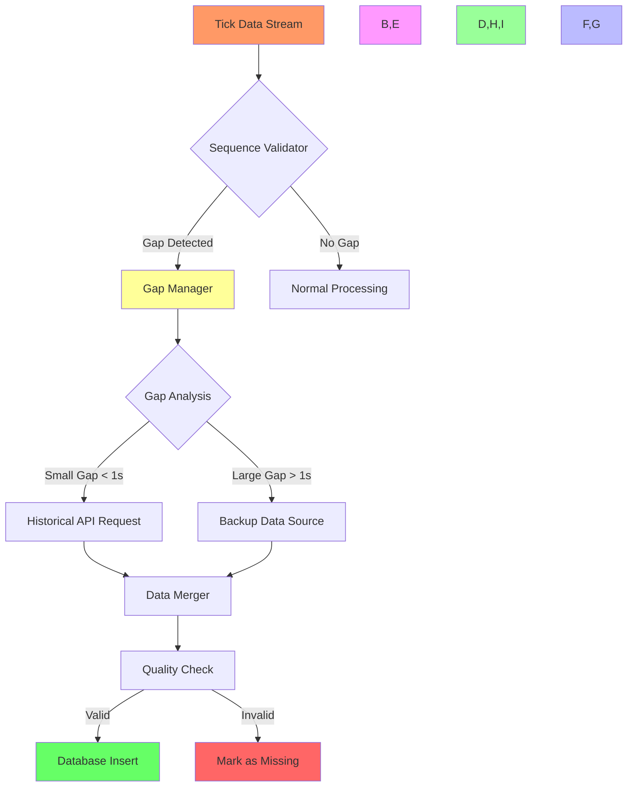

### Data Interpolation Strategy for Unrecoverable Gaps

```typescript
class DataInterpolationManager {
    private readonly MAX_INTERPOLATION_WINDOW = 5000; // 5 seconds in ms

    async handleUnrecoverableGap(gap: GapInfo): Promise<InterpolationResult> {
        // If gap is too large, don't interpolate
        if (gap.gapSize > this.MAX_INTERPOLATION_WINDOW) {
            return this.markAsUnrecoverable(gap);
        }

        const surroundingData = await this.getSurroundingData(gap);
        return this.interpolateData(gap, surroundingData);
    }

    private async interpolateData(
        gap: GapInfo,
        surroundingData: SurroundingData
    ): Promise<InterpolationResult> {
        const strategy = this.selectInterpolationStrategy(gap, surroundingData);
        
        switch (strategy) {
            case 'LINEAR':
                return this.linearInterpolation(gap, surroundingData);
            case 'VWAP':
                return this.vwapBasedEstimation(gap, surroundingData);
            case 'LAST_KNOWN':
                return this.lastKnownValueFill(gap, surroundingData);
            case 'ZERO_FILL':
                return this.zeroFill(gap);
            default:
                return this.markAsUnrecoverable(gap);
        }
    }

    private selectInterpolationStrategy(
        gap: GapInfo,
        surroundingData: SurroundingData
    ): InterpolationStrategy {
        const gapDuration = gap.endTime - gap.startTime;
        
        // For very short gaps (< 500ms), use linear interpolation
        if (gapDuration < 500) {
            return 'LINEAR';
        }
        
        // For gaps during high volatility, use VWAP
        if (this.isHighVolatility(surroundingData)) {
            return 'VWAP';
        }
        
        // For gaps < 2s, use last known value
        if (gapDuration < 2000) {
            return 'LAST_KNOWN';
        }
        
        // For larger gaps, use zero fill to indicate missing data
        return 'ZERO_FILL';
    }

    private async linearInterpolation(
        gap: GapInfo,
        { before, after }: SurroundingData
    ): Promise<InterpolationResult> {
        const timeDiff = after.timestamp - before.timestamp;
        const priceDiff = after.price - before.price;
        const volumeDiff = after.volume - before.volume;
        
        const interpolatedPoints = [];
        const numPoints = gap.gapSize;
        
        for (let i = 1; i <= numPoints; i++) {
            const ratio = i / (numPoints + 1);
            interpolatedPoints.push({
                timestamp: before.timestamp + (timeDiff * ratio),
                price: before.price + (priceDiff * ratio),
                volume: Math.round(before.volume + (volumeDiff * ratio)),
                interpolated: true,
                confidence: this.calculateConfidence('LINEAR', ratio)
            });
        }
        
        return {
            success: true,
            method: 'LINEAR',
            data: interpolatedPoints,
            confidence: this.calculateAverageConfidence(interpolatedPoints)
        };
    }

    private async vwapBasedEstimation(
        gap: GapInfo,
        surroundingData: SurroundingData
    ): Promise<InterpolationResult> {
        const vwap = await this.calculateVWAP(surroundingData);
        const interpolatedPoints = [];
        
        for (let i = 1; i <= gap.gapSize; i++) {
            interpolatedPoints.push({
                timestamp: gap.startTime + (i * this.getTickInterval()),
                price: vwap,
                volume: Math.round(surroundingData.averageVolume),
                interpolated: true,
                confidence: this.calculateConfidence('VWAP', 0.7) // VWAP typically has good confidence
            });
        }
        
        return {
            success: true,
            method: 'VWAP',
            data: interpolatedPoints,
            confidence: 0.7
        };
    }

    private async lastKnownValueFill(
        gap: GapInfo,
        { before }: SurroundingData
    ): Promise<InterpolationResult> {
        const interpolatedPoints = [];
        
        for (let i = 1; i <= gap.gapSize; i++) {
            interpolatedPoints.push({
                timestamp: gap.startTime + (i * this.getTickInterval()),
                price: before.price,
                volume: 0, // Zero volume for last known value fill
                interpolated: true,
                confidence: this.calculateConfidence('LAST_KNOWN', 0.5)
            });
        }
        
        return {
            success: true,
            method: 'LAST_KNOWN',
            data: interpolatedPoints,
            confidence: 0.5
        };
    }

    private async zeroFill(gap: GapInfo): Promise<InterpolationResult> {
        const interpolatedPoints = [];
        
        for (let i = 1; i <= gap.gapSize; i++) {
            interpolatedPoints.push({
                timestamp: gap.startTime + (i * this.getTickInterval()),
                price: 0,
                volume: 0,
                interpolated: true,
                confidence: 0
            });
        }
        
        return {
            success: true,
            method: 'ZERO_FILL',
            data: interpolatedPoints,
            confidence: 0
        };
    }

    private calculateConfidence(
        method: InterpolationStrategy,
        baseConfidence: number
    ): number {
        // Adjust confidence based on market conditions
        const marketConditionFactor = this.getMarketConditionFactor();
        const timeFactor = this.getTimeFactor();
        
        return baseConfidence * marketConditionFactor * timeFactor;
    }
}

// Database schema for interpolated data
```sql
CREATE TABLE interpolated_data (
    id SERIAL PRIMARY KEY,
    instrument_token BIGINT,
    timestamp TIMESTAMP WITH TIME ZONE,
    price DECIMAL(10, 2),
    volume BIGINT,
    interpolation_method VARCHAR(20),
    confidence_score FLOAT,
    gap_id BIGINT REFERENCES data_gaps(gap_id),
    created_at TIMESTAMP WITH TIME ZONE DEFAULT CURRENT_TIMESTAMP
);

CREATE INDEX idx_interpolated_data_instrument_time 
ON interpolated_data(instrument_token, timestamp);
```

### Interpolation Method Selection Logic

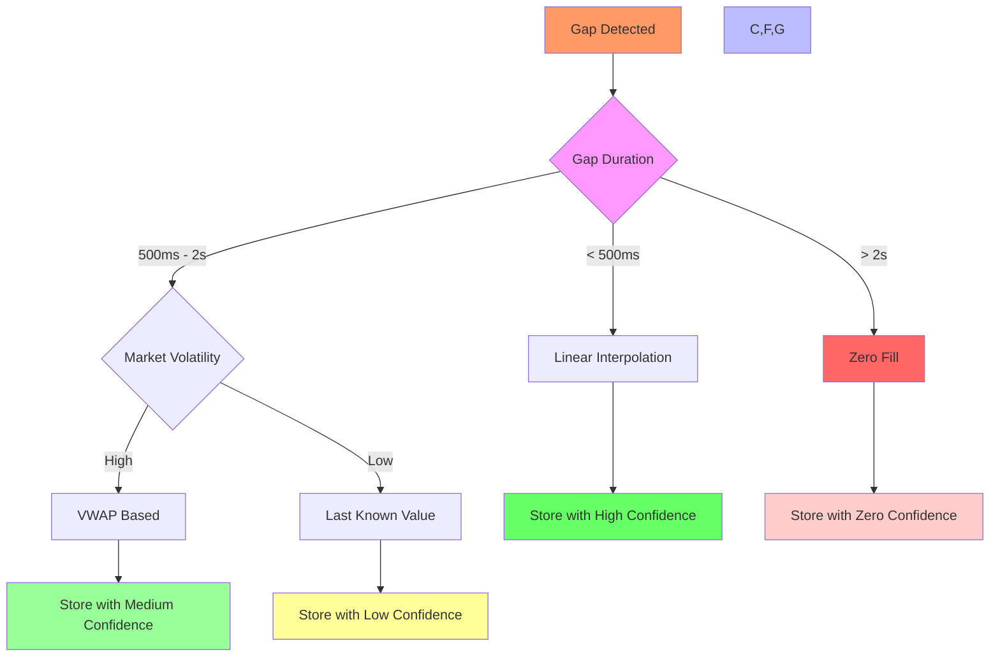

### Data Confidence Levels

1. **High Confidence (0.8 - 1.0)**
   - Linear interpolation for small gaps
   - Strong market correlation
   - Normal trading hours

2. **Medium Confidence (0.5 - 0.7)**
   - VWAP-based estimation
   - Moderate market correlation
   - Regular trading patterns

3. **Low Confidence (0.2 - 0.4)**
   - Last known value fill
   - High volatility periods
   - Irregular trading patterns

4. **Zero Confidence (0.0)**
   - Zero fill for large gaps
   - Extreme market conditions
   - System failures

### Quality Assurance Measures

1. **Data Validation Rules**
   - Price continuity checks
   - Volume consistency validation
   - Timestamp sequence verification
   - Market hours alignment
   - Tick frequency monitoring

2. **Recovery Priority Levels**
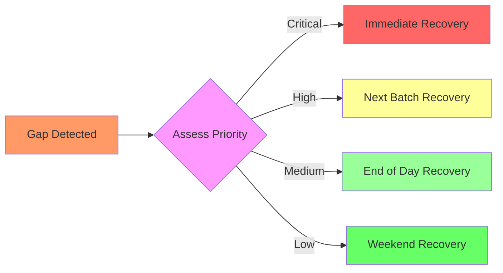

3. **Monitoring and Alerts**
   - Real-time gap detection alerts
   - Recovery process status notifications
   - Data quality metric dashboards
   - System health monitoring

### Data Integrity Tables

```sql
-- Sequence tracking table
CREATE TABLE tick_sequences (
    instrument_token BIGINT,
    timestamp TIMESTAMP WITH TIME ZONE,
    sequence_number BIGINT,
    status VARCHAR(20), -- 'COMPLETE', 'PARTIAL', 'MISSING'
    PRIMARY KEY (instrument_token, timestamp)
);

-- Gap tracking table
CREATE TABLE data_gaps (
    gap_id SERIAL PRIMARY KEY,
    instrument_token BIGINT,
    start_time TIMESTAMP WITH TIME ZONE,
    end_time TIMESTAMP WITH TIME ZONE,
    gap_duration INTERVAL,
    recovery_status VARCHAR(20), -- 'PENDING', 'IN_PROGRESS', 'RECOVERED', 'FAILED'
    recovery_attempts INT DEFAULT 0,
    last_attempt_time TIMESTAMP WITH TIME ZONE,
    recovery_source VARCHAR(50), -- 'HISTORICAL_API', 'BACKUP_SOURCE', 'MANUAL'
    created_at TIMESTAMP WITH TIME ZONE DEFAULT CURRENT_TIMESTAMP
);

-- Data quality table
CREATE TABLE data_quality_metrics (
    metric_id SERIAL PRIMARY KEY,
    instrument_token BIGINT,
    timestamp TIMESTAMP WITH TIME ZONE,
    completeness_score FLOAT, -- Percentage of expected data points present
    accuracy_score FLOAT,     -- Based on validation rules
    source VARCHAR(50),       -- 'REALTIME', 'HISTORICAL', 'BACKUP'
    anomaly_flags JSONB,      -- Stores any detected anomalies
    created_at TIMESTAMP WITH TIME ZONE DEFAULT CURRENT_TIMESTAMP
);
```

### Recovery Process Flow

1. **Gap Detection**
```typescript
interface TickSequence {
    instrumentToken: number;
    timestamp: number;
    expectedSequence: number;
    actualSequence: number;
}

class GapDetector {
    private readonly MAX_SEQUENCE_GAP = 5; // Maximum acceptable gap
    private sequenceMap: Map<number, number> = new Map();

    detectGap(tick: TickData): GapInfo | null {
        const lastSequence = this.sequenceMap.get(tick.instrument_token) || tick.sequence - 1;
        const expectedSequence = lastSequence + 1;
        
        if (tick.sequence > expectedSequence) {
            return {
                instrumentToken: tick.instrument_token,
                startSequence: expectedSequence,
                endSequence: tick.sequence - 1,
                timestamp: tick.timestamp,
                gapSize: tick.sequence - expectedSequence
            };
        }
        
        this.sequenceMap.set(tick.instrument_token, tick.sequence);
        return null;
    }
}
```

2. **Recovery Strategy**
```typescript
class DataRecoveryManager {
    private readonly SMALL_GAP_THRESHOLD = 1000; // 1 second in ms
    
    async recoverData(gap: GapInfo): Promise<RecoveryResult> {
        const gapDuration = this.calculateGapDuration(gap);
        
        if (gapDuration <= this.SMALL_GAP_THRESHOLD) {
            return await this.recoverFromHistoricalAPI(gap);
        } else {
            return await this.recoverFromBackupSource(gap);
        }
    }
    
    private async recoverFromHistoricalAPI(gap: GapInfo): Promise<RecoveryResult> {
        try {
            const historicalData = await kiteAPI.getHistoricalData({
                instrument_token: gap.instrumentToken,
                from: new Date(gap.timestamp - gap.gapSize * 100),
                to: new Date(gap.timestamp),
                interval: "minute"
            });
            
            return {
                success: true,
                source: 'HISTORICAL_API',
                data: historicalData,
                quality: await this.validateData(historicalData)
            };
        } catch (error) {
            return this.handleRecoveryFailure(gap, error);
        }
    }
}
```

3. **Data Validation and Merger**
```typescript
class DataMerger {
    async mergeRecoveredData(
        recoveredData: RecoveredData[],
        existingData: TickData[]
    ): Promise<MergeResult> {
        // Sort both datasets by timestamp
        const merged = [...existingData];
        
        for (const recovered of recoveredData) {
            const insertIndex = this.findInsertPosition(merged, recovered.timestamp);
            
            // Validate data point before insertion
            if (this.validateDataPoint(recovered)) {
                merged.splice(insertIndex, 0, recovered);
            } else {
                await this.logInvalidData(recovered);
            }
        }
        
        return {
            mergedData: merged,
            qualityMetrics: await this.calculateQualityMetrics(merged)
        };
    }
    
    private validateDataPoint(data: RecoveredData): boolean {
        return (
            this.isPriceWithinRange(data) &&
            this.isVolumeConsistent(data) &&
            this.isTimestampValid(data)
        );
    }
}
```

4. **Database Update Strategy**
```typescript
class DatabaseManager {
    async updateWithRecoveredData(
        mergeResult: MergeResult,
        gapInfo: GapInfo
    ): Promise<void> {
        await this.dbClient.transaction(async (trx) => {
            try {
                // Update tick data
                await trx('tick_data').insert(mergeResult.mergedData);
                
                // Update gap tracking
                await trx('data_gaps').update({
                    recovery_status: 'RECOVERED',
                    recovery_source: mergeResult.source,
                    recovered_at: new Date()
                }).where({ gap_id: gapInfo.id });
                
                // Record quality metrics
                await trx('data_quality_metrics').insert({
                    instrument_token: gapInfo.instrumentToken,
                    timestamp: new Date(),
                    completeness_score: mergeResult.qualityMetrics.completeness,
                    accuracy_score: mergeResult.qualityMetrics.accuracy,
                    source: mergeResult.source
                });
                
                await trx.commit();
            } catch (error) {
                await trx.rollback();
                throw error;
            }
        });
    }
}

```

### VIX Data Management

```typescript
class VIXDataManager {
    private readonly VIX_INSTRUMENT_TOKEN = 'INDIA VIX';
    private readonly UPDATE_INTERVAL = 1000; // 1 second
    private lastVIXValue: number = 0;
    private vixTrend: 'UP' | 'DOWN' | 'STABLE' = 'STABLE';
    
    constructor(private kiteClient: KiteConnect) {
        this.startVIXMonitoring();
    }

    private async startVIXMonitoring() {
        // Subscribe to VIX updates
        await this.kiteClient.subscribe([this.VIX_INSTRUMENT_TOKEN]);
        this.setupVIXListeners();
    }

    private setupVIXListeners() {
        this.kiteClient.on('ticks', async (ticks: KiteTick[]) => {
            const vixTick = ticks.find(t => t.instrument_token === this.VIX_INSTRUMENT_TOKEN);
            if (vixTick) {
                await this.processVIXTick(vixTick);
            }
        });
    }

    private async processVIXTick(tick: KiteTick): Promise<void> {
        const vixData: VIXData = {
            timestamp: new Date(tick.timestamp),
            value: tick.last_price,
            change: tick.change,
            high: tick.high,
            low: tick.low,
            open: tick.open,
            close: tick.close,
            trend: this.calculateTrend(tick.last_price)
        };

        await this.storeVIXData(vixData);
        await this.updateVIXCache(vixData);
        this.notifyVIXSubscribers(vixData);
    }

    private calculateTrend(currentValue: number): 'UP' | 'DOWN' | 'STABLE' {
        if (currentValue > this.lastVIXValue * 1.01) return 'UP';
        if (currentValue < this.lastVIXValue * 0.99) return 'DOWN';
        return 'STABLE';
    }

    private async storeVIXData(data: VIXData): Promise<void> {
        await this.dbClient.transaction(async (trx) => {
            try {
                await trx('vix_data').insert({
                    timestamp: data.timestamp,
                    value: data.value,
                    change: data.change,
                    high: data.high,
                    low: data.low,
                    open: data.open,
                    close: data.close,
                    trend: data.trend
                });

                // Store in time-series format for efficient querying
                await trx('vix_timeseries').insert({
                    timestamp: data.timestamp,
                    value: data.value
                });

                await trx.commit();
            } catch (error) {
                await trx.rollback();
                throw error;
            }
        });
    }

    private async updateVIXCache(data: VIXData): Promise<void> {
        await this.redisClient.multi()
            .set('current_vix', JSON.stringify(data))
            .zadd('vix_history', data.timestamp.getTime(), JSON.stringify(data))
            .exec();
    }

    // VIX Analysis Methods
    async calculateVolatilityRegime(): Promise<VolatilityRegime> {
        const recentVIX = await this.getRecentVIXData(20); // Last 20 data points
        const avgVIX = this.calculateAverage(recentVIX);
        
        return {
            current: avgVIX,
            regime: this.categorizeVolatilityRegime(avgVIX),
            timestamp: new Date()
        };
    }

    private categorizeVolatilityRegime(vixValue: number): string {
        if (vixValue < 15) return 'LOW_VOLATILITY';
        if (vixValue < 25) return 'NORMAL_VOLATILITY';
        if (vixValue < 35) return 'HIGH_VOLATILITY';
        return 'EXTREME_VOLATILITY';
    }
}

// Database Schema for VIX Data
```sql
-- Main VIX data table
CREATE TABLE vix_data (
    id SERIAL PRIMARY KEY,
    timestamp TIMESTAMP WITH TIME ZONE NOT NULL,
    value DECIMAL(10, 2) NOT NULL,
    change DECIMAL(10, 2),
    high DECIMAL(10, 2),
    low DECIMAL(10, 2),
    open DECIMAL(10, 2),
    close DECIMAL(10, 2),
    trend VARCHAR(10),
    created_at TIMESTAMP WITH TIME ZONE DEFAULT CURRENT_TIMESTAMP
);

-- Time-series optimized table
CREATE TABLE vix_timeseries (
    timestamp TIMESTAMP WITH TIME ZONE NOT NULL,
    value DECIMAL(10, 2) NOT NULL
) PARTITION BY RANGE (timestamp);

-- Create partitions for better query performance
CREATE TABLE vix_timeseries_current PARTITION OF vix_timeseries
    FOR VALUES FROM (CURRENT_DATE - INTERVAL '1 day') 
    TO (CURRENT_DATE + INTERVAL '1 day');

CREATE TABLE vix_timeseries_history PARTITION OF vix_timeseries
    FOR VALUES FROM (MINVALUE) 
    TO (CURRENT_DATE - INTERVAL '1 day');

-- Indexes for efficient querying
CREATE INDEX idx_vix_data_timestamp ON vix_data(timestamp);
CREATE INDEX idx_vix_timeseries_timestamp ON vix_timeseries(timestamp);
```

### VIX Data Flow

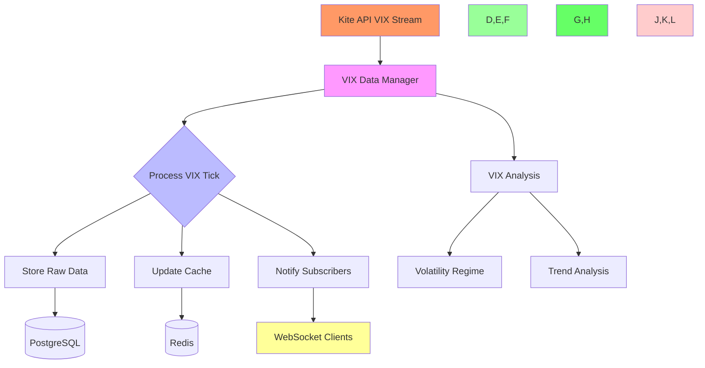

### VIX Data Usage

1. **Real-time Monitoring**
   - Current VIX value and trend
   - Volatility regime classification
   - Sudden spike detection

2. **Historical Analysis**
   - VIX trends over time
   - Correlation with market movements
   - Volatility regime transitions

3. **Trading Signals**
   - High/Low volatility alerts
   - Trend reversal detection
   - Regime change notifications

4. **Risk Management**
   - Position sizing based on VIX
   - Stop-loss adjustments
   - Portfolio hedging signals

### VIX Alert Thresholds

```typescript
interface VIXAlertConfig {
    suddenSpikeThreshold: number;     // e.g., 10% change in 5 minutes
    regimeChangeThreshold: number;     // e.g., 20% change in regime
    extremeVolatilityLevel: number;    // e.g., VIX > 35
    lowVolatilityLevel: number;        // e.g., VIX < 15
}

```

## SQLAlchemy Data Flow

### 1. Data Ingestion Pipeline
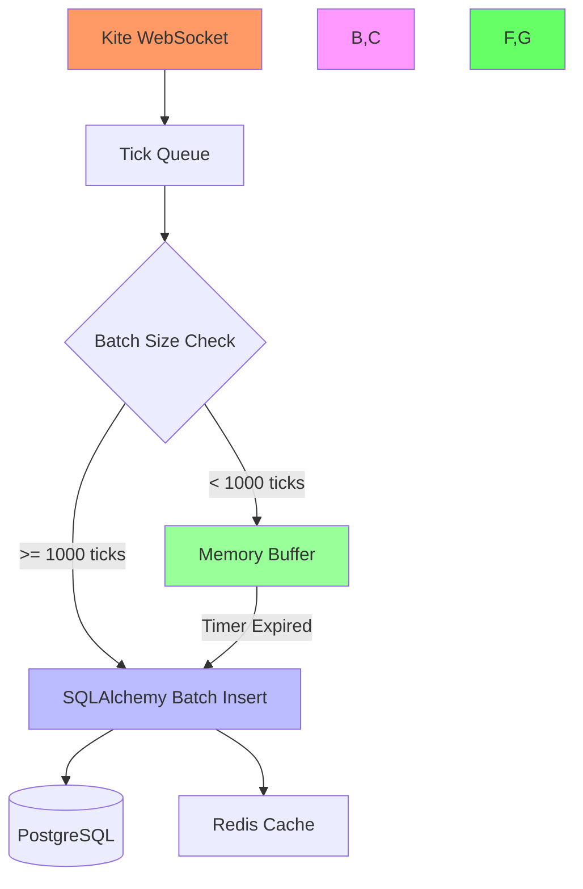

### 2. Session Management
```python
# Optimized Session Factory
AsyncSessionLocal = async_sessionmaker(
    engine,
    class_=AsyncSession,
    expire_on_commit=False,  # Don't expire objects after commit
    autocommit=False,       # Manual transaction control
    autoflush=False        # Manual flush control
)

# Connection Pool Configuration
engine = create_async_engine(
    DATABASE_URL,
    poolclass=QueuePool,
    pool_size=20,          # Optimized for HFT
    max_overflow=30,       # Additional connections
    pool_timeout=30,       # Connection timeout
    pool_recycle=3600     # Hourly connection recycling
)
```

### 3. Batch Processing Strategy
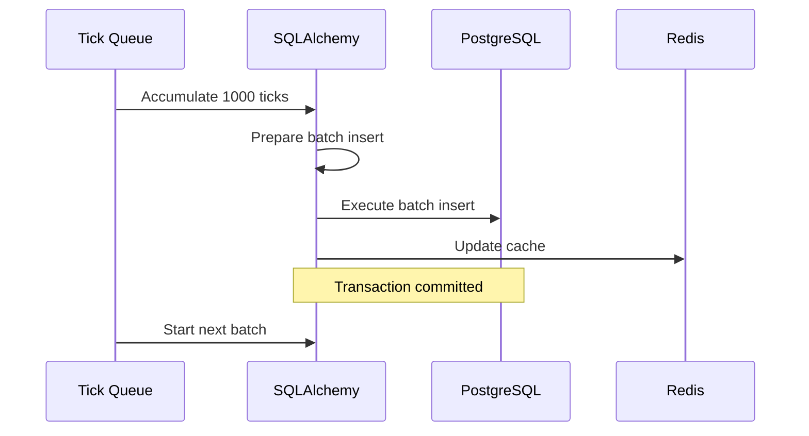

### 4. Data Access Patterns
```python
# Efficient Time-series Queries
async def get_market_data(
    session: AsyncSession,
    instrument_token: int,
    start_time: datetime,
    end_time: datetime
) -> List[MarketData]:
    """Optimized time-series query"""
    stmt = select(MarketData).where(
        MarketData.instrument_token == instrument_token,
        MarketData.timestamp.between(start_time, end_time)
    ).order_by(
        MarketData.timestamp.desc()
    ).execution_options(
        stream_results=True  # Memory efficient
    )
    
    result = await session.execute(stmt)
    return result.scalars().all()

# Batch Inserts with Conflict Resolution
async def batch_insert_ticks(
    session: AsyncSession,
    ticks: List[Dict[str, Any]]
) -> None:
    """Efficient batch insert with UPSERT"""
    stmt = pg_insert(MarketData).values(ticks)
    stmt = stmt.on_conflict_do_update(
        index_elements=['instrument_token', 'timestamp'],
        set_={
            'last_price': stmt.excluded.last_price,
            'volume': stmt.excluded.volume,
            'oi': stmt.excluded.oi
        }
    )
    await session.execute(stmt)
    await session.commit()
```

### 5. Partitioning Management
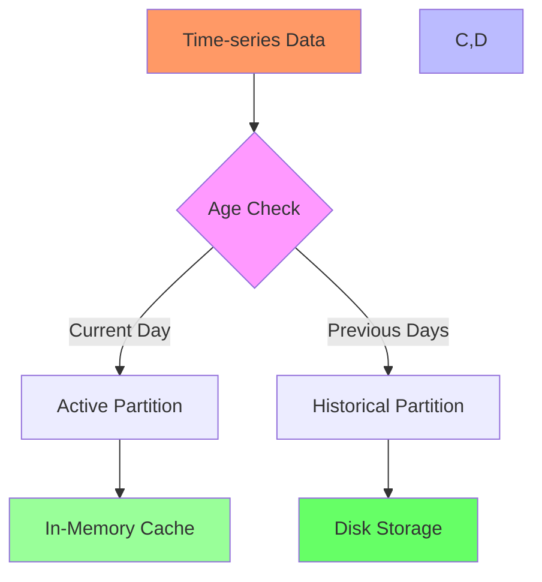

### 6. Data Integrity Measures
```python
# Transaction Management
async def process_market_data(
    session: AsyncSession,
    data: Dict[str, Any]
) -> None:
    """Atomic data processing with rollback"""
    try:
        # Start transaction
        async with session.begin():
            # Insert market data
            await session.execute(
                insert(MarketData).values(data)
            )
            
            # Update analytics
            await session.execute(
                insert(Analytics).values({
                    'metric_type': 'MARKET_UPDATE',
                    'value': calculate_metrics(data)
                })
            )
            
            # Commit transaction
            await session.commit()
    except Exception as e:
        await session.rollback()
        raise e
```

```sql
-- Main VIX data table
CREATE TABLE vix_data (
    id SERIAL PRIMARY KEY,
    timestamp TIMESTAMP WITH TIME ZONE NOT NULL,
    value DECIMAL(10, 2) NOT NULL,
    change DECIMAL(10, 2),
    high DECIMAL(10, 2),
    low DECIMAL(10, 2),
    open DECIMAL(10, 2),
    close DECIMAL(10, 2),
    trend VARCHAR(10),
    created_at TIMESTAMP WITH TIME ZONE DEFAULT CURRENT_TIMESTAMP
);

-- Time-series optimized table
CREATE TABLE vix_timeseries (
    timestamp TIMESTAMP WITH TIME ZONE NOT NULL,
    value DECIMAL(10, 2) NOT NULL
) PARTITION BY RANGE (timestamp);

-- Create partitions for better query performance
CREATE TABLE vix_timeseries_current PARTITION OF vix_timeseries
    FOR VALUES FROM (CURRENT_DATE - INTERVAL '1 day') 
    TO (CURRENT_DATE + INTERVAL '1 day');

CREATE TABLE vix_timeseries_history PARTITION OF vix_timeseries
    FOR VALUES FROM (MINVALUE) 
    TO (CURRENT_DATE - INTERVAL '1 day');

-- Indexes for efficient querying
CREATE INDEX idx_vix_data_timestamp ON vix_data(timestamp);
CREATE INDEX idx_vix_timeseries_timestamp ON vix_timeseries(timestamp);
